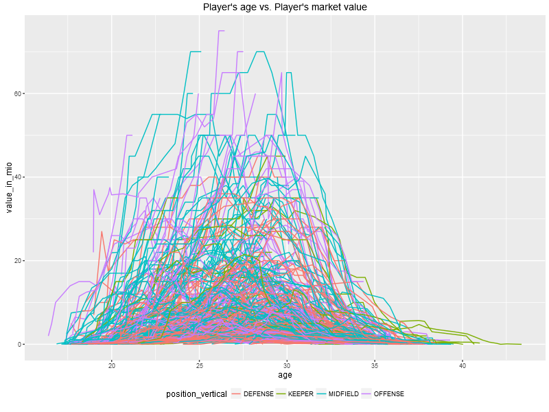
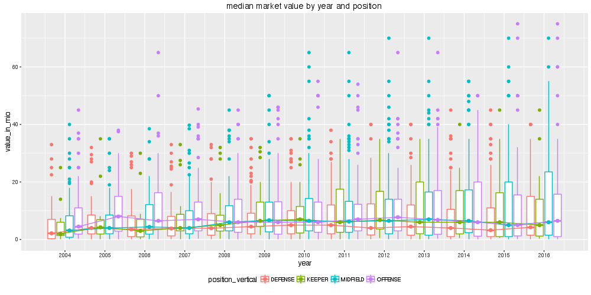
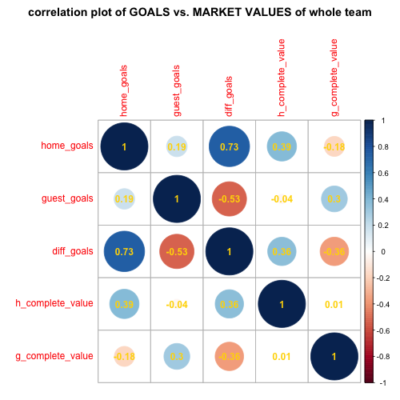
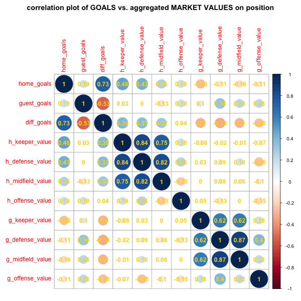

# soccer-cs-stats
Comparisson and explorative data analysis of soccer championship data. The insights are getting used in [soccer-cs-prediction](https://github.com/teeschke/soccer-cs-prediction).

### data source
Data from [Fuflballdaten.de](http://www.fussballdaten.de) and [Transfermarkt.de](http://www.transfermarkt.de). Postgres DB hosted on Heroku.

### content
Data contains currently 15 national teams[^1] with its 391 national players and its market values. 68 championship or quali matches from the last 10 years (2006-2016).

[^1]: list of national teams: BELGIUM, CROATIA, CZECH_REPUBLIC, ENGLAND, FRANCE, GERMANY, IRELAND, ITALY, POLAND, RUSSIA, SLOVAKIA, SPAIN, SWEDEN, SWITZERLAND, UKRAINE

### about market values and ages

### about change of market values over the years

### about correlation between goals and market value of the whole teams

### about correlation between goals and market values on positions
